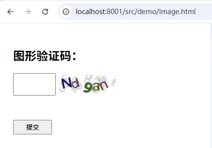
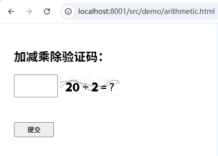
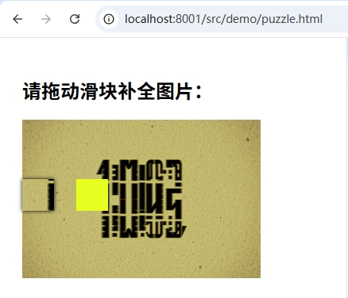
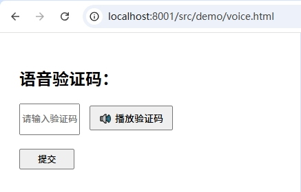

# Captcha 验证码组件

支持以下验证码类型：

* [图形验证码](#图形验证码)
* [算数验证码](#算数验证码)
* [拼图验证码](#拼图验证码)
* [语音验证码](#语音验证码)

> 需要 PHP >= 7.4

---

## 启动 demo

```bash
# 进入项目目录
cd captcha/

# 启动 PHP 服务
php -S localhost:8001
```

### 访问地址

| 类型    | 链接                                                                                               |
| ----- | ------------------------------------------------------------------------------------------------ |
| 图形验证码 | [http://localhost:8001/src/demo/image.html](http://localhost:8001/src/demo/image.html)           |
| 算数验证码 | [http://localhost:8001/src/demo/arithmetic.html](http://localhost:8001/src/demo/arithmetic.html) |
| 拼图验证码 | [http://localhost:8001/src/demo/puzzle.html](http://localhost:8001/src/demo/puzzle.html)         |
| 语音验证码 | [http://localhost:8001/src/demo/voice.html](http://localhost:8001/src/demo/voice.html)           |

---

## 效果展示

| 图形                        | 算数                             | 拼图                         | 语音                        |
| ------------------------- | ------------------------------ | -------------------------- | ------------------------- |
|  |  |  |  |

---

## 通用参数

| 字段            | 类型     | 是否必填 | 描述                                    |
| ------------- | ------ | ---- | ------------------------------------- |
| `type`        | string | 是    | 验证码类型，如 `image`，`puzzle`，`arithmetic` |
| `cacheType`   | string | 否    | 验证码缓存类型，默认 SESSION，可以选 REDIS          |
| `id`          | string | 否    | 操作标识 ID，适用于 Session                   |
| `seKey`       | string | 否    | 默认 `CAPTCHA_TOKEN`                    |
| `redisConfig` | array  | 否    | Redis 配置，包括 host, port, password, db  |

---

## 图形验证码

### 说明

支持中文，英文，默认不区分大小写

### 请求参数

| 字段                | 类型     | 是否必填 | 描述             |
| ----------------- | ------ | ---- | -------------- |
| `length`          | int    | 否    | 长度，默认 5        |
| `charsType`       | string | 否    | 类型 `en` 或 `zh` |
| `isCaseSensitive` | bool   | 否    | 是否区分大小写        |
| `width`           | int    | 否    | 宽度，默认 120      |
| `height`          | int    | 否    | 高度，默认 40       |

### 返回值

| 字段         | 类型     | 描述        |
| ---------- | ------ | --------- |
| `src`      | string | base64 图片 |
| `cache_id` | string | 缓存 ID     |

---

## 算数验证码

### 请求参数

| 字段       | 类型  | 是否必填 | 描述        |
| -------- | --- | ---- | --------- |
| `width`  | int | 否    | 宽度，默认 120 |
| `height` | int | 否    | 高度，默认 40  |

### 返回值

| 字段         | 类型     | 描述        |
| ---------- | ------ | --------- |
| `src`      | string | base64 图片 |
| `result`   | int    | 算数结果      |
| `cache_id` | string | 缓存 ID     |

---

## 拼图验证码

### 请求参数

| 字段             | 类型           | 是否必填 | 描述      |
| -------------- | ------------ | ---- | ------- |
| `images`       | string/array | 否    | 背景图片    |
| `imgWidth`     | int          | 否    | 抽离块宽度   |
| `imgHeight`    | int          | 否    | 抽离块高度   |
| `targetWidth`  | int          | 否    | 背景图宽度   |
| `targetHeight` | int          | 否    | 背景图高度   |
| `bgRgb`        | array        | 否    | 背景 rgba |
| `bgBorderRgb`  | array        | 否    | 边框 rgba |

### 返回值

| 字段         | 类型     | 描述            |
| ---------- | ------ | ------------- |
| `bg`       | string | 含缺口的背景 base64 |
| `puzzle`   | string | 抽离块 base64    |
| `offset`   | int    | 正确偏移          |
| `top`      | int    | 竖直偏移          |
| `width`    | int    | 抽离块宽度         |
| `height`   | int    | 抽离块高度         |
| `cache_id` | string | 缓存 ID         |

---

## 语音验证码

### 请求参数

| 字段          | 类型     | 是否必填 | 描述                         |
| ----------- | ------ | ---- | -------------------------- |
| `length`    | int    | 否    | 默认 5                       |
| `voiceDir`  | string | 否    | wav 文件夹                    |
| `voiceLang` | string | 否    | zh，en，en-us，en-uk，fr，de，es |
| `voiceTemp` | string | 否    | 默认 `您的验证码是 %s`             |
| `voiceS`    | int    | 否    | 词/分钟（80\~450）              |
| `voiceP`    | int    | 否    | 音调（0\~99）                  |
| `voiceA`    | int    | 否    | 音量（0\~200）                 |

### 返回值

| 字段         | 类型     | 描述          |
| ---------- | ------ | ----------- |
| `src`      | string | 语音 wav 文件路径 |
| `cache_id` | string | 缓存 ID       |

---

## 安装

```bash
composer require chenjiangbin/captcha
```

---

## 使用示例
请参考 `src/Demo` 下的文件
